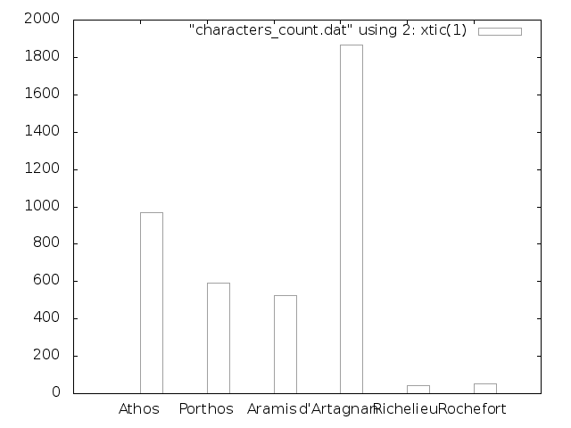
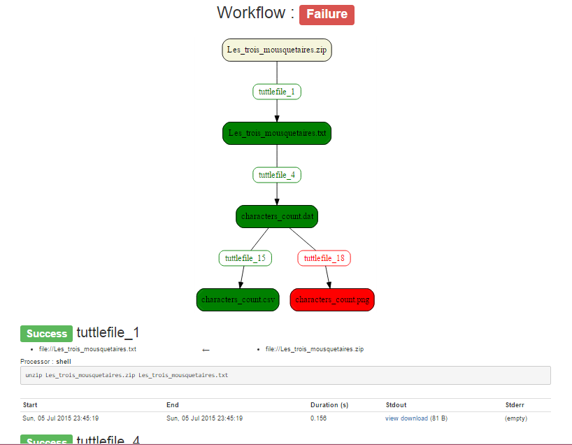
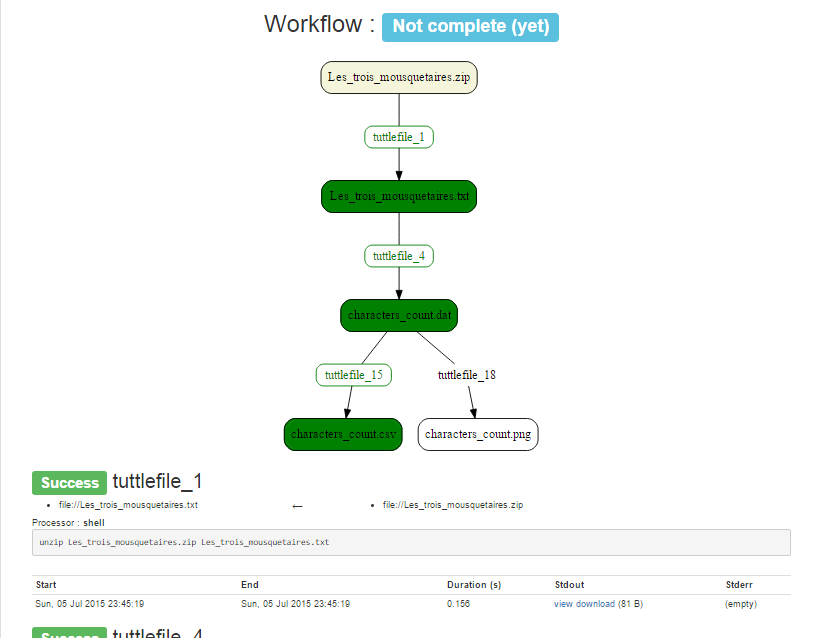

# Tutorial


The purpose of this tutorial is to explain, line by line, the [demo project](tutorial_steps/step10) which
parses the the novel *The Three Musketeers*, to count how many times each characters are mentioned. From a zip archive,
you will extract the text to produce this graph :



and a [csv file](tutorial_steps/step9/characters_count.csv) you can import in a spreadsheet software.

This tutorial works on Linux, and you'll need to install [`tuttle`](https://github.com/lexman/tuttle/releases) as
well as [gnuplot](http://www.gnuplot.info/) . We'll use little python, gnuplot and shell code, but don't worry if
you don't know some of these languages : we'll focus on the method, not the code.

## Unzip the novel

In an empty directory, download the [zip](Les_trois_mousquetaires.zip).
Then create a file called `tuttlefile` and paste this code :

    file://Les_trois_mousquetaires.txt <- file://Les_trois_mousquetaires.zip
        unzip Les_trois_mousquetaires.zip Les_trois_mousquetaires.txt

On line 1, we tell tuttle that we intend to produce Les_trois_mousquetaires.txt from the file Les_trois_mousquetaires.zip.
How do we achieve that ? With the shell code provided on line 2 : by calling online zip utility. Notice the indentation
 that delimits the code.

Let's run this workflow :

```console
lexman@lexman-pc:~$ cd tuttle_tutorial
lexman@lexman-pc:~/tuttle_tutorial$ tuttle run
============================================================
tuttlefile_1
============================================================
--- stdout : -----------------------------------------------
Archive:  Les_trois_mousquetaires.zip
  inflating: Les_trois_mousquetaires.txt

====
Done
lexman@lexman-pc:~/tuttle_tutorial$
```

The output displays `tuttlefile_1` which the identifier of the *process* in the *workflow*. The identifier is made from
the filename `tuttlefile` and the line number of the process. After the identifier, we can see the outputs
of the process... In our case, it is the output of the unzip command. 

We have ran our first *workflow*. We can take a look at our workspace :

```console
lexman@lexman-pc:~/tuttle_tutorial$ ls -la
total 1854
drwxrwx--- 1 lexman lexman    4096 mai   25 22:59 .
drwxrwx--- 1 lexman lexman    4096 mai   25 22:51 ..
-rwxrwx--- 1 lexman lexman 1389543 mai   24 20:27 Les_trois_mousquetaires.txt
-rwxrwx--- 1 lexman lexman  495538 mai   24 20:36 Les_trois_mousquetaires.zip
drwxrwx--- 1 lexman lexman       0 mai   25 22:57 .tuttle
-rwxrwx--- 1 lexman lexman     785 mai   25 23:00 tuttlefile

lexman@lexman-pc:~/tuttle_tutorial$ head Les_trois_mousquetaires.txt
PRÉFACE

dans laquelle il est établi que malgré leurs noms en os et en is, les héros de l'histoire que nous allons avoir l'honneur de raconter à
[...]
capricieux du poète n'est pas toujours ce qui impressionne la masse des lecteurs. Or, tout en admirant, comme les autres les admireront sans doute, les détails que nous avons signalés, la chose qui nous préoccupa le plus est une chose à laquelle bien certainement personne avant nous n'avait fait la moindre attention.
lexman@lexman-pc:~/tuttle_tutorial$
```

Well, the text is in french, but it does look like a novel, as we expected. We have produced our first *resource* :
the file `Les_trois_mousquetaires.txt`.


## Count musketeers

For the next step, shell scripting won't be enough count the words in the text. We'll use a few lines of python for
parsing :

    file://characters_count.dat <- file://Les_trois_mousquetaires.txt ! python
        names = ["Athos", "Porthos", "Aramis", "D'Artagnan"]
        with open('characters_count.dat', 'w') as f_out:
            with open('Les_trois_mousquetaires.txt') as f_in:
                content = f_in.read()
            print("{} chars in the novel".format(len(content)))
            for name in names:
                f_out.write("{}\t{}\n".format(name, content.count(name)))
                print("{} - done".format(name))

At the end of line 1, `! python` tells tuttle to use the python *processor* to run the process. That means
the next lines will be executed as python code.

In a few words, this program loads all the text from The Three Musketeers in memory. Then for each musketeer's name,
it counts the number of occurrences and writes a line in file characters_count.dat. The script also prints a log line
each time musketeer has complete.

Let's run it :

```console
lexman@lexman-pc:~/tuttle_tutorial$ tuttle run
============================================================
tuttlefile_4
============================================================
--- stdout : -----------------------------------------------
1389543 chars in the novel
Athos - done
Porthos - done
Aramis - done
D'Artagnan - done

====
Done
lexman@lexman-pc:~/tuttle_tutorial$
```

You will notice `tuttle` has only run the necessary *process* : the first process (`tuttlefile_1`) had already run, so only
the new process `tuttlefile_4` has been executed.

Let's have a look at the result :

```console
lexman@lexman-pc:~/tuttle_tutorial$ cat characters_count.dat
Athos	968
Porthos	587
Aramis	523
D'Artagnan	367
lexman@lexman-pc:~/tuttle_tutorial$
```

Now have the figures in a tabular file that `gnuplot` will understand.

Before we go on, let's take a look at the report : open the file
[`.tuttle/report.html`](step2/.tuttle/tuttle_report.html) in your browser :


You can see everything that has happen in our workflow : duration of the processes,
whether they have failed, a graph of their dependencies. You can even download all the logs.


## Export to spreadsheet

Before we draw the graph, we'll have to respond to our curious coworker who's very interested in our data. He asked for
`characters_count.dat`, so we have sent him the file, but he can't open it with his favorite spreadsheet software,
which appear to have his specific dialect concerning csv.

According to this particular software, strings should be quoted, columns needs to be separated by a comma instead of a tabulation... And
end of line have to be windows style !

A simple line of awk does the trick :

    file://characters_count.csv <- file://characters_count.dat
        awk '{print "\""$1"\","$2"\r"}' characters_count.dat > characters_count.csv

So we `tuttle run` the workflow and see (in vi) exactly what we expected :

    968,"Athos"^M
    587,"Porthos"^M
    523,"Aramis"^M
    367,"D'Artagnan"^M

He'll be happy to receive the file by mail.

Now is the time to commit your work in your versifying system, eg `git`, if you haven't done it already.

You just have to commit the `tuttlefile`, and also `Les_trois_mousquetaires.zip` (because it is a *primary resource* : a resource that
is not generated by the workflow). The *primary resources* appear in yellow in the report. Other *resources* like
`Les_trois_mousquetaires.txt` or `characters_count.dat` can always be re-generated by tuttle, from te `tuttlefile` and
the primary resources. You can even re-generate them as they used to be, for each version from source control history.


## Make the bar graph

Now we have a file `characters_count.dat` in a format that gnuplot understands. To make a graph from our data, `gnuplot`
need this kind of program on the standard input :

    set terminal png
    set output "characters_count.png"
    plot "characters_count.dat" using 2: xtic(1) with histogram

Tuttle does not have a gnuplot processor (... yet ! *pull requests are welcome*), so we'll use the
[here doc](http://en.wikipedia.org/wiki/Here_document#Unix_shells) syntax to insert it in a shell *process* :

    file://characters_count.png <- file://characters_count.dat
        gnuplot <<$script$
        set terminal png
        set output "characters_count.png"
        plot "characters_count.dat" using 2: xtic(1) with histogram
        $script$

After we've ran tuttle, we can see the graph :


Now once again we can commit our work...


## Fix the maths

But wait ? Have you looked closely at this graph ? Do you truly believe the main character, *D'Artagnan* is mentioned two or three
times less thant his fellow companions ? There must have been an issue somewhere.

After a few verifications, you'll find that the main character's name can be `D'Artagnan` as well as `d'Artagnan`. In
fact `d'Artagnan` seems to be the correct way to spell it, and `D'Artagnan` is used only at the beginning of sentences.

In real life we usually don't find bugs as soon as we make them, but some time afterwards... When
data is really used for the first time. And it's oten our final users who find the last tiny mistakes...

We'll have to fix python code by making it robust to case. In the new code, all strings are converted to lower case
with the `lower()` function before comparisons :

    file://characters_count.dat <- file://Les_trois_mousquetaires.txt !# python
        names = ["Athos", "Porthos", "Aramis", "d'Artagnan"]
        with open('characters_count.dat', 'w') as f_out:
            with open('Les_trois_mousquetaires.txt') as f_in:
                content_low = f_in.read().lower()
            print("{} chars in the novel".format(len(content_low)))
            for name in names:
                name_low = name.lower()
                f_out.write("{}\t{}\n".format(name, content_low.count(name_low)))
                print("{} - done".format(name))

Let's see what happens when we run this new process :

```console
lexman@lexman-pc:~/tuttle_tutorial$ tuttle run
The following resources are not valid any more and will be removed :
* file://characters_count.dat - Process code has changed
* file://characters_count.csv - Resource depends on file://characters_count.dat that have changed
* file://characters_count.png - Resource depends on file://characters_count.dat that have changed
1 seconds of processing will be lost
============================================================
tuttlefile_4
============================================================
--- stdout : -----------------------------------------------
1389543 chars in the novel
Athos - done
Porthos - done
Aramis - done
d'Artagnan - done

============================================================
tuttlefile_15
============================================================
============================================================
tuttlefile_18
============================================================
====
Done
lexman@lexman-pc:~/tuttle_tutorial$
```

`Tuttle` has noticed the change in the code. Before running the necessary *processes*, the **workspace is cleaned** deleting all the
*resources* that no longer fit with the current workflow : `characters_count.dat` is not valid any more because we have
changed the process that produces it. And `characters_count.png` and `characters_count.csv` will be re-processed
because they depend on the former.

Eventually, all the resources are guaranteed to be up to date and coherent with your code.

As you see, it is **easy** to change code and **experiment** with tuttle

By the way, do you remember this colleague who wanted a spreadsheet. Without any effort, we are ready to mail him the
update !


## Include bad guys

After a discussion with your teammates, you agreed you should count bad guys too. Your
colleague *Michel* will be in charge of that task.

The first thing he does is checking out the code from the repository to his own computer, then he changes the list of
people to count on line 2 :

    file://characters_count.dat <- file://Les_trois_mousquetaires.txt !# python
        names = ["Athos", "Porthos", "Aramis", "d'Artagnan", "Richelieu", "Rochefort"]
        with open('characters_count.dat', 'w') as f_out:
            with open('Les_trois_mousquetaires.txt') as f_in:
                content_low = f_in.read().lower()
            print("{} chars in the novel".format(len(content_low)))
            for name in names:
                name_low = name.lower()
                f_out.write("{}\t{}\n".format(name, content_low.count(name_low)))
                print("{} - done".format(name))

When he executes `tuttle run` he can see the result, even make a few experiments, and when is work is over, he commits
and shares it to the central code repository.


Without `tuttle` he would have to tell you that the python code he has changed, so you can delete
`characters_count.dat`, and also `characters_count.png` and `characters_count.csv`. Then you
could recompute those files.

Now, whih `tuttle`, the only thing you have to do to benefit from his work, is retrieve the modifications from the
versioning system (eg `git pull --rebase` if you work with git), and `tuttle run` : your teammate's work will be
incorporated into yours, and only the file that have changed will be re-processed.

With this feature, `tuttle` let you can work on data as you work on code : use **branches**, **merge** with your team,
even use a **continuous integration** server like Jenkins that will always keep your data up-to-date !

## Improve the graph

After all this work, the project does basically what you want. But we all have to agree this graph is really ugly... It
would be a lot nicer in green !

After reading the `gnuplot` doc, it seem we only have to add a line in the end :

    file://characters_count.png <- file://characters_count.dat
        gnuplot <<$script$
        set terminal png
        set output "characters_count.png"
        plot "characters_count.dat" using 2: xtic(1) with histogram
        linecolor rgb "green"
        $script$

But when we run the `tuttlefile`, we have this output :

```console
The following resources are not valid any more and will be removed :
* file://characters_count.png - Process code has changed
0 seconds of processing will be lost
============================================================
tuttlefile_18
============================================================
--- stderr : -----------------------------------------------

gnuplot> linecolor rgb "green"
         ^
         line 0: invalid command


Process ended with error code 1
```

Something went wrong !

Apparently, `gnuplot` didn't like the last raw. Let's have a look at the report in `.tuttle\report.html` :



First, you can't miss the workflow has failed, and which process is in error. You also notice that
`characters_count.png` is in red. It means that according to the execution of the workflow
you can't rely on the file `characters_count.png`.

Actually, as soon an error occurs, `tuttle` stops and leaves everything *'as is'* so you can debug.

So let's have a look at files on the directory : we can see one called `characters_count.png`. This means that
gnuplot have produced it ! So what happened ? gnuplot has crashed **after** the png has been produced.

If you want to revert to a clean state, you can execute `tuttle invalidate` :

```console
lexman@lexman-pc:~/tuttle_tutorial$ tuttle invalidate
The following resources are not valid any more and will be removed :
* file://characters_count.png - The resource has been produced by a failing process
0 seconds of processing will be lost
lexman@lexman-pc:~/tuttle_tutorial$
```

`tuttle` has removed all the files that where not valid, as we can see in the report :



In this state where everything is green, we can rely on all the files available.


But let's go on : we still want our green graph. Maybe color should be declared **before** the `plot` instruction :

    file://characters_count.png <- file://characters_count.dat
        gnuplot <<$script$
        set terminal png
        set output "characters_count.png"
        linecolor rgb "green"
        plot "characters_count.dat" using 2: xtic(1) with histogram
        $script$

Let's `tuttle run` :

```console
lexman@lexman-pc:~/tuttle_tutorial$ tuttle run
The following resources are not valid any more and will be removed :
* file://characters_count.png - Process code has changed
0 seconds of processing will be lost
============================================================
tuttlefile_18
============================================================
--- stderr : -----------------------------------------------

gnuplot> linecolor rgb "green"
         ^
         line 0: invalid command


Process ended with error code 1
```

Tuttle could start execution but an error occurred once again. Is this error really our fault ? Well, if
rebooting windows solves many issues, why not `tuttle run` again ?

```console
lexman@lexman-pc:~/tuttle_tutorial$ tuttle run
Workflow already failed on process 'tuttlefile_18'. Fix the process and run tuttle again.

If failure has been caused by an external factor like a connection breakdown, use "tuttle invalidate" to reset execution then "tuttle run" again.
lexman@lexman-pc:~/tuttle_tutorial$
```

So `tuttle` refuses to run : we haven't changed anything in the code, so why would the issue be fixed ?

The good way is to investigate in order to write a proper fix in the tuttlefile. In our situation,
the `gnuplot` doc says the color must be set on the same line as the `plot` intruction :

    file://characters_count.png <- file://characters_count.dat
        gnuplot <<$script$
        set terminal png
        set output "characters_count.png"
        plot "characters_count.dat" using 2: xtic(1) with histogram linecolor rgb "green"
        $script$

`tuttlle run` :

```console
lexman@lexman-pc:~/tuttle_tutorial$ tuttle run
The following resources are not valid any more and will be removed :
* file://characters_count.png - Process code has changed
0 seconds of processing will be lost
============================================================
tuttlefile_18
============================================================
====
Done
lexman@lexman-pc:~/tuttle_tutorial$
```

There it is ! `tuttle` has seen the change in the code, it has removed invalid files, and have run the necessary
process... Now we can see our graph has the expected color :


In this paragraph, we have seen how `tuttle` let you to investigate errors and fix them with few efforts because
you don't have to worry about cleaning your previous work.


## Describe the plot in a separate file

Actually, the lines we have written are a kind of program, run by the `gnuplot` interpreter. This is very similar
 to python code.

A  normal command line user would create a separate file called `myplot.gnuplot`, with this content :

        set terminal png
        set output "characters_count.png"
        plot "characters_count.dat" using 2: xtic(1) with histogram linecolor "green"

and he would only have to run

        gnuplot myplot.gnuplot

But how can we benefit from reprocessing when the code change, with this language that have not been implemented in
`tuttle` ? We only have to add the code as a dependency :

    file://characters_count.png <- file://characters_count.dat, file://myplot.gnuplot
        gnuplot myplot.gnuplot


With this method, you can ensure re-processing of the png file when `myplot.gnuplot` changes.

## Follow the source from the web

The first thing we have done at the beginning of this tutorial was to download the zip file. The good news is that
`tuttle` recognises http resources. You can even download a resource in one line with the *download* processor :

    file://Les_trois_mousquetaires.zip <- http://lexman.github.io/tuttle/docs/musketeers_assets/Les_trois_mousquetaires.zip ! download

That's all ! The `download` processor is smart enough to understand it has to download the http input resource into
the destination.

When we `tuttle run`, what will happen ? `tuttle` can't know for sure whether the file `Les_trois_mousquetaires.zip` in
the workspace is exactly the same as the remote one. Not before it downloads it. Therefore, `tuttle` will invalidate the
file `Les_trois_mousquetaires.zip` and all the *resources* that used to depend on it. Then it will download the file and
 run all the processes again... In order to guarantee that the result of the workflow's execution is the correct, and coherent with our
`tuttlefile`.

```console
lexman@lexman-pc:~/tuttle_tutorial$ tuttle run
The following resources are not valid any more and will be removed :
* file://Les_trois_mousquetaires.zip - The former primary resource has to be created by tuttle
* file://Les_trois_mousquetaires.txt - Resource depends on file://Les_trois_mousquetaires.zip that have changed
* file://characters_count.dat - Resource depends on file://Les_trois_mousquetaires.txt that have changed
* file://characters_count.csv - Resource depends on file://characters_count.dat that have changed
* file://characters_count.png - Resource depends on file://characters_count.dat that have changed
0 seconds of processing will be lost
============================================================
tuttlefile_1
============================================================
--- stdout : -----------------------------------------------
Downloading http://lexman.github.io/tuttle/docs/musketeers_assets/Les_trois_mousquetaires.zip
................
done

============================================================
tuttlefile_3
============================================================
--- stdout : -----------------------------------------------
Archive:  Les_trois_mousquetaires.zip
  inflating: Les_trois_mousquetaires.txt

============================================================
tuttlefile_6
============================================================
--- stdout : -----------------------------------------------
1389543 chars in the novel
Athos - done
Porthos - done
Aramis - done
d'Artagnan - done
Richelieu - done
Rochefort - done

============================================================
tuttlefile_17
============================================================
============================================================
tuttlefile_20
============================================================
====
Done
lexman@lexman-pc:~/tuttle_tutorial$
```

Now, if the source changes on the internet, for example because
[the digitalized text is still being reviewed by volunteers](https://fr.wikisource.org/wiki/Livre:Dumas_-_Les_Trois_Mousquetaires_-_1849.djvu)
, updates will be easy!

If the zip file changes online, `tuttle run` will notice the change in the *primary resource*. It will invalidate every
thing that depends on it and run the necessary processes again.

## Prevent from reprocessing too much

The drawback of using remote resources, is that we don't always control them. What will happen it the person who
published the zip updates it while we are working on the gnuplot part ? The whole the workflow could be invalidated !

This could be a problem if you have a long workflow... Imagine that our python process would begin
by a heavy processing phase, like this `sleep(10)` instruction :

    file://characters_count.dat <- file://Les_trois_mousquetaires.txt !# python
        import time
        time.sleep(10)
        names = ["Athos", "Porthos", "Aramis", "d'Artagnan"]
        with open('characters_count.dat', 'w') as f_out:
            with open('Les_trois_mousquetaires.txt') as f_in:
                content_low = f_in.read().lower()
            print("{} chars in the novel".format(len(content_low)))
            for name in names:
                name_low = name.lower()
                f_out.write("{}\t{}\n".format(name, content_low.count(name_low)))
                print("{} - done".format(name))


To prevent from unexpected reprocessing, there is a `--threshold` parameter (in short `-t`) in the command line :
```console
lexman@lexman-pc:~/tuttle_tutorial$ tuttle run -t 5
The following resources are not valid any more and will be removed :
* file://characters_count.dat - Process code has changed
* file://characters_count.csv - Resource depends on file://characters_count.dat that have changed
* file://characters_count.png - Resource depends on file://characters_count.dat that have changed
You were about to loose 10 seconds of processing time (which exceeds the 5 seconds threshold).
Aborting...
lexman@lexman-pc:~/tuttle_tutorial$
```

Here, we have specifically stated we don't want invalidation if it has to remove more than 5 seconds of processing. That's why
tuttle has stopped.

This feature can prove very useful when you merge modifications from your teammates :)

## Bonus : detach from the web

Now let's see if you have understood how tuttle works... Suppose you want to work on this workflow in the
countryside where you don't have access to Internet. If we run our workflow offline, `tuttle` will try
to check if the Les_trois_mousquetaires.zip has changed remotely. Without connexion, the resource will
be considered as an error, so everything in the workflow would be invalidated. To prevent loosing our work
we want to disconnect from the remote resource by removing this line from the `tuttlefile` :

    file://Les_trois_mousquetaires.zip <- http://lexman.github.io/tuttle/docs/musketeers_assets/Les_trois_mousquetaires.zip ! download

Now, ask yourself : what will happen when we execute `tuttle run` ?

[](https://www.flickr.com/photos/86979666@N00/7623744452/in/gallery-alexandraeh-72157644697955569/)


```console
lexman@lexman-pc:~/tuttle_tutorial$ tuttle run
====
Done
lexman@lexman-pc:~/tuttle_tutorial$
```

What has happened ?

`Les_trois_mousquetaires.zip`is now a *primary resource*. When running, tuttle checks whether the file
has changed since we last ran the workflow... And because it is the same, everything is still valid !


## Conclusion

In this tutorial about the command `tuttle run`, we have seen :
* how you can chain *processes* from various languages (shell, python) through explicit declaration
of input and output *resources*
* that processes will be run only if necessary
* that if you change a line of code, everything that depends on it will be reprocessed
* that if you change a *primary resources*, everything that depends on it will be reprocessed
* that tuttle plays well with source control : you can merge, rebase, fork your project, your data will always be up-to-date with your source, with the minimum of processing
* that you can integrate continuously your data in a reference server
* that recovery from error consist only in changing the buggy code : tuttle will clean up previous execution for you
* that you can use any language in tuttle, even the one that have not been natively implemented yet
* that debuging is easy thanks to the html report, the logs and cheap experimentation


Happy processing !